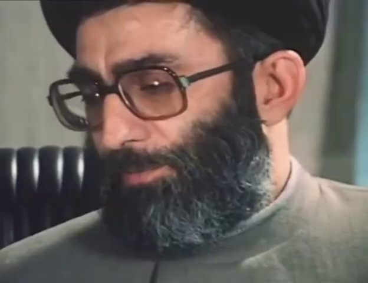
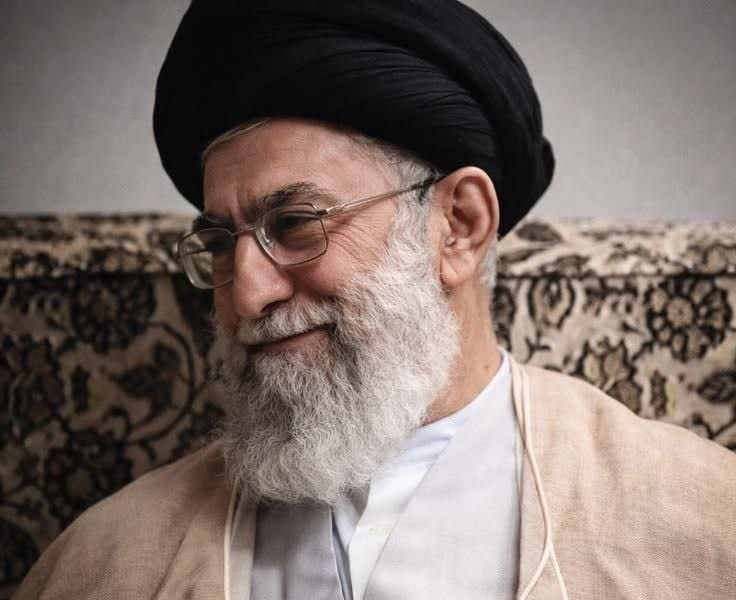
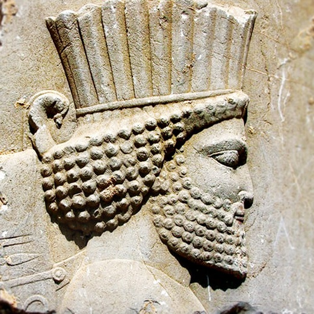
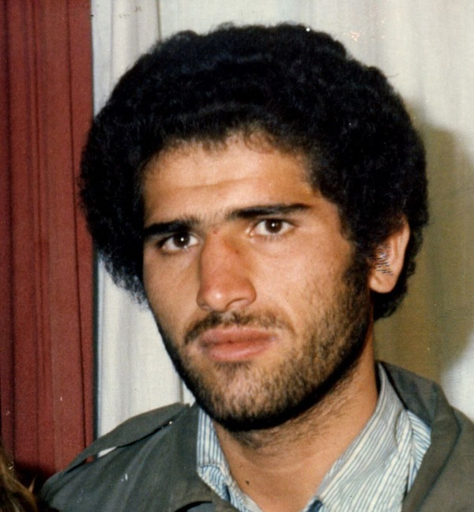

# Exercise: Learning and Inverting Image Filters with CNNs

## Overview

In this exercise, you will explore the relationship between classical image processing filter 'Prewitt' and Convolutional Neural Networks. You will:

1. **Learn a filter**: Train a CNN to discover the Prewitt edge detection filter
2. **Invert a filter**: Reconstruct an image from its filtered version (inverse problem)
3. **Multi-filter reconstruction**: Use two filters simultaneously for better reconstruction

---

## Setup (Provided)

```python
import torch
import torch.nn as nn
import torch.optim as optim
import numpy as np
import matplotlib.pyplot as plt
from PIL import Image
from scipy.signal import correlate2d

# Set random seeds
torch.manual_seed(42)
np.random.seed(42)

# Define filters
PREWITT_X = np.array([
    [1, 0, -1],
    [1, 0, -1],
    [1, 0, -1]
], dtype=np.float32)

PREWITT_Y = np.array([
    [1, 1, 1],
    [0, 0, 0],
    [-1, -1, -1]
], dtype=np.float32)

```

---

## Image Loading (Complete this function)

```python
def load_image(image_path):
    """
    Load an image from file and convert to grayscale numpy array [0, 1].
    
    Steps:
    1. Use PIL.Image.open() to load the image
    2. Convert to grayscale if it's RGB (use .convert('L'))
    3. Convert to numpy array with dtype=float32
    4. Normalize to range [0, 1] by dividing by 255
    
    Returns:
        numpy array of shape (H, W) with values in [0, 1]
    """
    # TODO: Implement image loading
    pass

# Load your image
IMAGE_PATH = 'input-image.jpg'  # Change to your image path
original_image = load_image(IMAGE_PATH)

print(f"Image shape: {original_image.shape}")
print(f"Image range: [{original_image.min():.3f}, {original_image.max():.3f}]")

# Visualize
plt.figure(figsize=(6, 6))
plt.imshow(original_image, cmap='gray')
plt.title('Original Input Image')
plt.axis('off')
plt.show()

# Convert to tensor for PyTorch
# TODO: Convert original_image to torch tensor with shape (1, 1, H, W)
# Hint: Use torch.tensor(), .float(), .unsqueeze(), and move to device if available
input_tensor = None  # Replace with your code
```

Some sample images:

|  |  |
|-----------|---------------|
|  |  |
|  |  |
|  [Gen M. Safa](https://www.hamshahrionline.ir/news/532645/%D8%A7%D8%AD%D8%AA%D8%B1%D8%A7%D9%85-%D9%88%DB%8C%DA%98%D9%87-%D8%A7%D9%86%DA%AF%D9%84%DB%8C%D8%B3%DB%8C-%D9%87%D8%A7-%D8%A8%D9%87-%D8%B4%DA%A9%D8%A7%D8%B1%DA%86%DB%8C-%D8%AA%D8%A7%D9%86%DA%A9-%D8%AA%D8%B5%D9%88%DB%8C%D8%B1-%D8%AA%D9%86%D8%AF%DB%8C%D8%B3-%D9%85%D8%AD%D9%85%D8%AF-%D8%B9%D9%84%DB%8C) |  [M. Pilafkan](https://www.mfpa.ir/fa/news/7245/%DB%8C%D8%A7%D8%AF%DB%8C-%DA%A9%D9%86%DB%8C%D9%85-%D8%A7%D8%B2-%D9%82%D9%87%D8%B1%D9%85%D8%A7%D9%86-%DA%86%D8%B2%D8%A7%D8%A8%D9%87-%D8%B4%D9%87%DB%8C%D8%AF-%D9%85%D8%A7%D8%B4%D8%A7%D8%A1%D8%A7%D9%84%D9%84%D9%87-%D9%BE%DB%8C%D9%84-%D8%A7%D9%81%DA%A9%D9%86) |

---

## Part 1: Learning the Prewitt Filter

### Problem Statement

The Prewitt filter for horizontal edge detection is:
```
[ 1  0 -1 ]
[ 1  0 -1 ]
[ 1  0 -1 ]
```

When applied to an image, it highlights vertical edges. Instead of manually coding this filter, we want a CNN to **learn** it from data.

**Task**: 
1. Create the target filtered image using `correlate2d` with the true Prewitt kernel
2. Build a single-layer CNN with random initialization
3. Train the network to match the target
4. Compare the learned weights with the true Prewitt kernel

### Why this works
The CNN has no knowledge of the Prewitt filter initially. Through gradient descent on MSE loss, it discovers that certain weight patterns (positive on left, negative on right) minimize the error.

### Code Template

```python
print("\n" + "="*60)
print("PART 1: Learning Prewitt Filter")
print("="*60)

# Step 1: Generate target using classical filtering
# TODO: Use correlate2d to apply PREWITT_X to original_image
# mode='same', boundary='wrap' preserves image size
target_prewitt = None  # Replace with your code

# Convert to tensor
target_tensor = torch.tensor(target_prewitt).float().unsqueeze(0).unsqueeze(0)

# Step 2: Define the model
class LearnableFilter(nn.Module):
    def __init__(self):
        super().__init__()
        # TODO: Define a Conv2d layer with:
        # - 1 input channel, 1 output channel
        # - kernel_size=3, padding=1 (to preserve size)
        # - bias=False (we only want the filter weights)
        # Do NOT initialize with Prewitt weights - use default random init
        self.conv = None  # Replace with your code
    
    def forward(self, x):
        # TODO: Apply the convolution
        pass

model1 = LearnableFilter()

# Step 3: Setup training
# TODO: Define MSE loss function
criterion = None  # Replace with your code

# TODO: Define Adam optimizer for model1.parameters() with lr=0.01
optimizer = None  # Replace with your code

# Step 4: Training loop
num_epochs = 500
losses = []

for epoch in range(num_epochs):
    # TODO: Complete the training loop:
    # 1. Set model to train mode
    # 2. Zero gradients
    # 3. Forward pass: model1(input_tensor)
    # 4. Compute loss with target_tensor
    # 5. Backward pass
    # 6. Optimizer step
    
    losses.append(loss.item())
    
    if (epoch + 1) % 200 == 0:
        print(f"Epoch [{epoch+1}/{num_epochs}], Loss: {loss.item():.6f}")

# Step 5: Extract and compare weights
learned_kernel = model1.conv.weight.data.squeeze().numpy()

print(f"\nTrue Prewitt kernel:\n{PREWITT_X}")
print(f"\nLearned kernel:\n{learned_kernel}")

# TODO: Compute and print the element-wise absolute difference
# What pattern do you observe in the learned kernel?

# Step 6: Visualization
# TODO: Create a 2x3 subplot showing:
# - Loss curve over epochs
# - True Prewitt kernel (imshow with RdBu_r colormap, vmin=-2, vmax=2)
# - Learned kernel (same colormap settings)
# - Input image
# - Target filtered image
# - Model output image

# Hint: Use model1.eval() and torch.no_grad() for inference
```

### Questions for Part 1

1. What values does the learned kernel converge to? Do they match the Prewitt filter (±1)?
2. What happens if you reduce the number of epochs? Increase learning rate?
3. Try with `padding=0` (valid convolution). How does the output size change and why?

---

## Part 2: Inverse Problem - Reconstructing from Filtered Output

### Problem Statement

Given:
- The **output** of a Prewitt filter (edges only)
- The **knowledge** of which filter was used

Recover the **original image**.

This is an **ill-posed inverse problem**: multiple images can produce similar edge maps. We solve it via optimization: start from random noise and iteratively adjust until applying Prewitt gives the target edge map.

### Key Insight

We freeze the filter weights (known) and optimize the **input image** instead.

### Code Template

```python
print("\n" + "="*60)
print("PART 2: Reconstructing from Single Filter Output")
print("="*60)

# Step 1: Create model with FIXED Prewitt weights
class FixedPrewittFilter(nn.Module):
    def __init__(self):
        super().__init__()
        self.conv = nn.Conv2d(1, 1, kernel_size=3, padding=1, bias=False)
        
        # TODO: Initialize conv weight with PREWITT_X tensor
        # Hint: torch.tensor(PREWITT_X).float().unsqueeze(0).unsqueeze(0)
        
        # TODO: Freeze all parameters (requires_grad = False)
        # We don't want to train the filter - it's fixed!
    
    def forward(self, x):
        return self.conv(x)

model2 = FixedPrewittFilter()

# Step 2: Prepare target (filtered image)
with torch.no_grad():
    target_single = model2(input_tensor)

# Step 3: Initialize optimizable image
# TODO: Create a random tensor with same shape as input_tensor
# requires_grad=True is crucial - we optimize THIS, not the model
reconstructed = None  # Replace with your code

# Step 4: Setup optimizer
# TODO: Adam optimizer, but optimize [reconstructed] not model parameters!
optimizer2 = None  # Replace with your code

# Step 5: Optimization loop with snapshots
num_iterations = 500
snapshot_interval = 100
snapshots = []  # Store intermediate results
losses2 = []

for iteration in range(num_iterations):
    # TODO: Complete optimization loop:
    # 1. Zero gradients
    # 2. Forward pass: apply model2 to reconstructed image
    # 3. Compute MSE loss against target_single
    # 4. Backward pass
    # 5. Optimizer step
    
    # TODO: Clamp reconstructed image to [0, 1] after each step
    # Hint: use .clamp_(0, 1) in torch.no_grad() context
    
    losses2.append(loss.item())
    
    if (iteration + 1) % snapshot_interval == 0:
        snapshots.append(reconstructed.squeeze().detach().numpy().copy())
        print(f"Iteration [{iteration+1}/{num_iterations}], Loss: {loss.item():.6f}")

# Step 6: Visualization
# TODO: Create visualization showing:
# - Original image
# - Target filtered image (what we tried to match)
# - Reconstruction progress: show snapshots at iterations 100, 200, ..., 500
# - Final reconstructed image vs original
# - Absolute difference map (use 'hot' colormap)
# - Loss curve

# Questions to consider:
# - Does the reconstruction perfectly match the original? Why or why not?
# - What information was lost in the filtering process?
```

### Questions for Part 2

1. Why start from random noise? What would happen if you started from all zeros or a blurred image?
2. The reconstruction is imperfect—what visual features are missing or wrong?
3. What does this tell you about edge detection filters? Are they invertible?

---

## Part 3: Multi-Filter Reconstruction

### Problem Statement

Using **one** filter loses information. Using **two** different filters provides complementary constraints.

We now have:
- Prewitt X output (sensitive to vertical gradients)
- Prewitt Y output 

Both describe the same underlying image. Can we reconstruct better with two constraints than one?

### Code Template

```python
print("\n" + "="*60)
print("PART 3: Reconstructing from Two Filter Outputs")
print("="*60)

# Step 1: Define model with TWO fixed filters
class TwoFixedFilters(nn.Module):
    def __init__(self):
        super().__init__()
        # TODO: Conv2d with 2 output channels (one for each filter)
        self.conv = None  # Replace with your code
        
        # TODO: Initialize weights: Channel 0 = PREWITT_X, Channel 1 = PREWITT_Y
        # Hint: Stack with np.stack([PREWITT_X, PREWITT_Y]), then convert to tensor
        # Shape should be (2, 1, 3, 3) for Conv2d weight
        
        # TODO: Freeze parameters
    
    def forward(self, x):
        # Returns shape: (batch, 2, H, W) - two filtered outputs
        return self.conv(x)

model3 = TwoFixedFilters()

# Step 2: Generate two targets simultaneously
with torch.no_grad():
    target_two = model3(input_tensor)  # Shape: [1, 2, H, W]
    
print(f"Target shape: {target_two.shape}")
print("  Channel 0: Prewitt X edges")
print("  Channel 1: Prewitt Y edges")

# Visualize both targets
# TODO: Show original + both filtered outputs side by side

# Step 3: Initialize reconstruction (same as Part 2)
reconstructed3 = None  # TODO: Random init with requires_grad=True
optimizer3 = None  # TODO: Adam optimizer for reconstructed3

# Step 4: Optimize to match BOTH channels
num_iterations = 500
snapshot_interval = 100
snapshots3 = []
losses3 = []

for iteration in range(num_iterations):
    # TODO: Optimization loop
    # Same as Part 2, but loss is computed on BOTH channels
    # The MSE automatically sums over all elements including both channels
    
    if (iteration + 1) % snapshot_interval == 0:
        snapshots3.append(reconstructed3.squeeze().detach().numpy().copy())
        print(f"Iteration [{iteration+1}/{num_iterations}], Loss: {loss.item():.6f}")

# Step 5: Comparison visualization
# TODO: Create comprehensive visualization:
# Row 1: Original, Prewitt-X target, Prewitt-Y target
# Row 2: Reconstruction progress (snapshots)
# Row 3: Final result, original, difference map, loss curve

# TODO: Compute and print final MSE vs original image
final3 = reconstructed3.squeeze().detach().numpy()
mse_two_filters = None  # TODO: Compute MSE

print(f"\nReconstruction MSE with two filters: {mse_two_filters:.6f}")
print(f"Compare to Part 2 (single filter): {mse_single:.6f}")
print(f"Improvement: {(1 - mse_two_filters/mse_single)*100:.1f}%")
```

### Questions for Part 3

1. Compare reconstruction quality: two filters vs one filter. Quantify the improvement.
2. Why does adding Prewitt-Y help? 
3. Can you perfectly reconstruct the original? What fundamental limits exist?

---

## Deliverables

Submit a Jupyter notebook containing:

1. **Completed code** for all three parts with your `# TODO` implementations
2. **Visualizations** for each part (use provided templates)
3. **Written answers** to all questions
4. **Bonus**: Experiment with different initialization strategies in Part 2 (random, zeros, blurred original) and report results

---

## Hints and Tips

- **Tensor shapes**: Use `.shape` frequently to debug. Conv2d expects `(N, C, H, W)`.
- **Device**: If you have GPU, move tensors with `.to(device)`. CPU works fine too.
- **Learning rate**: If training is unstable, reduce lr to 0.001.
- **Visualization**: Use `vmin, vmax` in `imshow` for consistent scaling.
- **Clamping**: Always clamp reconstructed images to [0,1] to stay in valid range.

---

## Learning Outcomes

After completing this exercise, you should understand:
- How CNNs can discover classical image processing operations
- The relationship between convolution and its "inverse" (deconvolution/reconstruction)
- Why multiple filters provide richer representations
- The information-theoretic limits of feature extraction